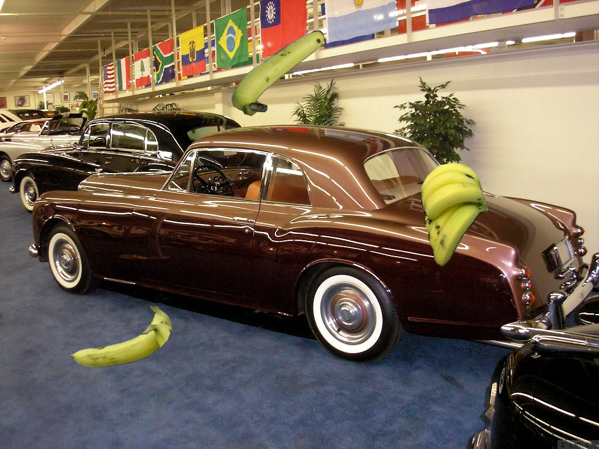
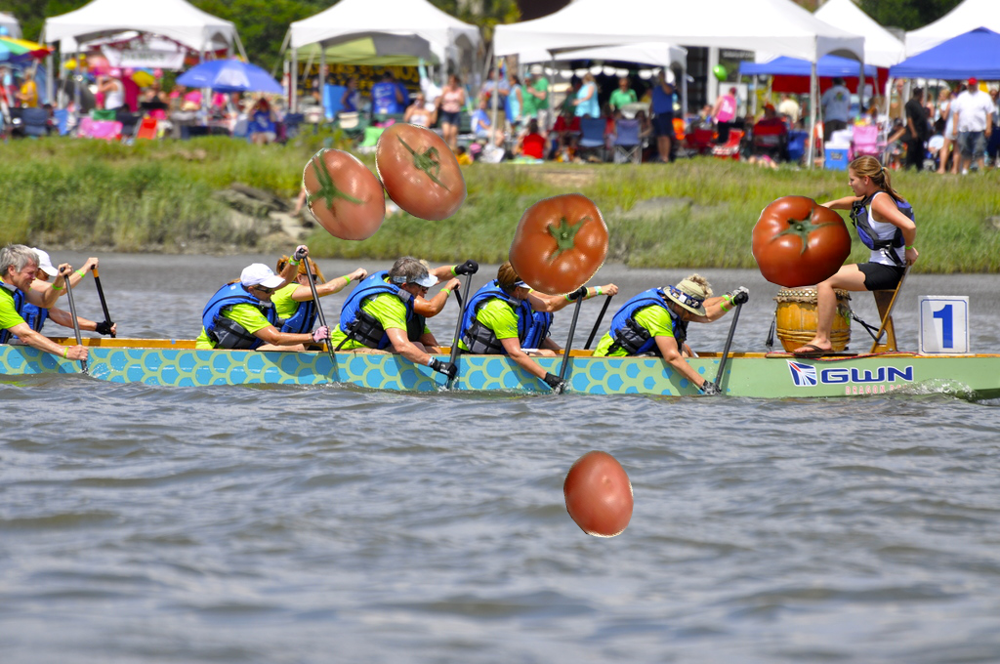

# dataset-gen

The repository contains scripts for generating the artificial classification dataset as well as routines for training and evaluating the classification model.

Two methods of generation are currently available

A **Copy-paste** method that randomly places objects of interest (i.e. masks of classified objects) on the background image. 
This method was described and implemented in javascript in [Roboflow guide](https://blog.roboflow.com/how-to-create-a-synthetic-dataset-for-computer-vision/). 
Here we have implemented this technique in Python, and also made sure that the foreground images do not overlap ([run_copy_paste_aug.py](data_scipts/run_copy_paste_aug.py)).

 
