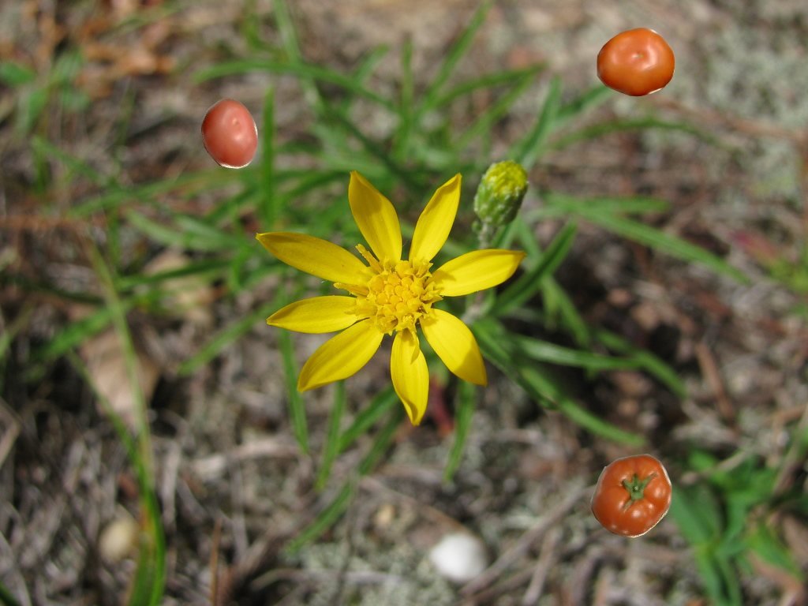
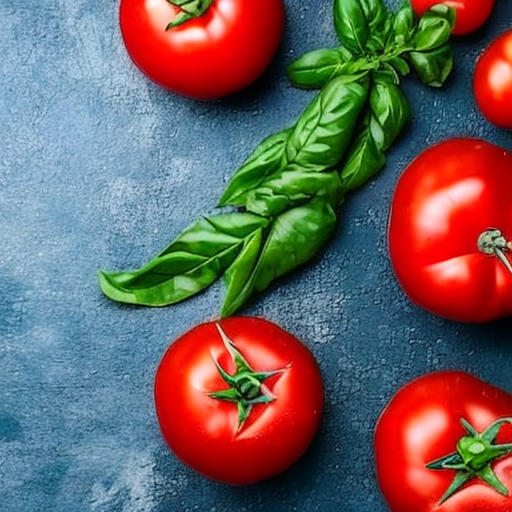
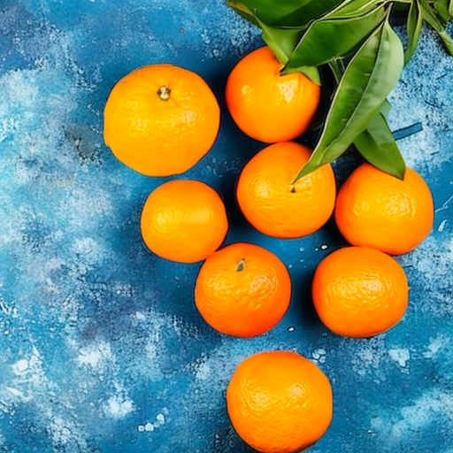

# dataset-gen

The repository contains scripts for generating the artificial classification dataset as well as routines for training and evaluating the classification model. 

Specifically methods listed below have been used to mimic [fruit dataset](https://www.kaggle.com/datasets/chrisfilo/fruit-recognition) but one can apply them to other domains as well. 
Two methods of generation are currently available

**Copy-paste** technique that randomly places objects of interest (i.e. masks of classified objects) on the background image. 
This method was described and implemented in javascript in [Roboflow guide](https://blog.roboflow.com/how-to-create-a-synthetic-dataset-for-computer-vision/). 
Here we have implemented this technique in Python, and also made sure that the foreground images do not overlap ([run_copy_paste_aug.py](data_scipts/run_copy_paste_aug.py)).
Examples are given below (bananas and tomatoes on random background images)

 

**Stable diffusion** [model](https://github.com/CompVis/stable-diffusion) is able to generate the whole scene using text prompt. For generating fruits the following prompt has been found to work well: "a photo of whole \<fruits\> on the table. top view" with negative prompt: "sliced, halved, cut" to avoid generating of sliced and cut fruits. See [stable_diffusion.ipynb](stable_diffusion.ipynb) for details. Original notebook can be found [here](https://github.com/woctezuma/stable-diffusion-colab). Examples are given below:

 

Training and evaluation script [vanilla_train.py](vanilla_train.py) can be configured using [config.json](config.json) file. It uses standard pretrained classification models from
[Timm library](https://huggingface.co/docs/timm/index) on Huggingface.

Small report based on the obtained results can be found here [Dataset_generation]("Dataset generation.pdf") .
